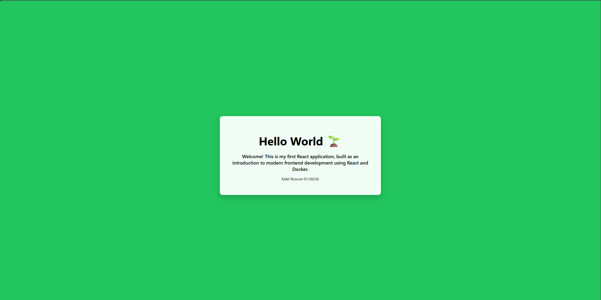

# React Hello World (Dockerized)

## 📌 Overview
This project is a simple **Hello World React application** created as an introduction
to modern frontend development. The application is fully containerized using **Docker**
and version-controlled with **GitHub**.

The goal of this assignment is to demonstrate:
- Basic React development
- Containerization with Docker
- Proper project documentation
- Git-based workflow

---

## 🛠 Technologies Used
- **React** – Frontend library
- **Node.js** – JavaScript runtime (inside Docker container)
- **Docker** – Containerization
- **Git & GitHub** – Version control

---

## 📂 Project Structure
ReactHelloWorld/
├── Dockerfile
├── package.json
├── src/
│ └── App.jsx
├── public/
└── README.md


---

## ✅ Prerequisites
The following must be installed on your system:

- **Docker Desktop**
- **Git**

> ⚠️ Node.js is NOT required on the host machine because the app runs entirely inside Docker.

---

## 🚀 Running the Application with Docker (Recommended)

### 1️⃣ Build the Docker image
From the root of the project directory:

```bash
docker build -t react-hello-world .

---

docker run -p 3000:3000 react-hello-world

---

http://localhost:3000

---

This is what the application should look like

